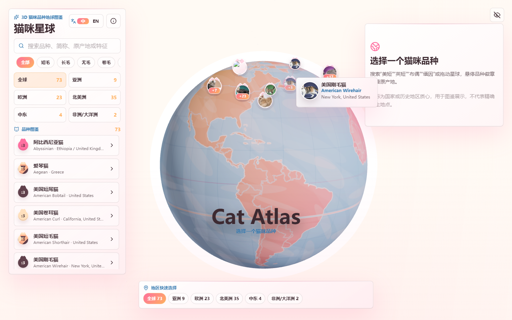

# 猫咪星球 Cat Planet

一个真实可交互的 3D 猫咪品种地球图鉴。项目基于 React、TypeScript、Three.js、Drei 和 GSAP 构建，用地球地图展示全球猫咪品种原产地，支持中文搜索、地区筛选、真实照片点位、移动端浏览和品种故事入口。

在线体验：

https://qq598516797-dotcom.github.io/cat-planet/

## 项目预览

### 3D 地球图鉴


### 点位展开与真实照片 marker



### 品种详情阅读


### 移动端适配


## 核心功能

- 真实 Three.js 3D 地球，不是图片或 CSS 假 3D。
- 全球猫咪品种原产地展示，点位使用真实猫咪照片头像。
- 智能聚合点位，桌面 hover 展开，移动端 tap 展开。
- 中文搜索支持常见叫法，例如美短、英短、布偶、缅因、无毛、矮脚、豹猫。
- 中英文切换。
- 地区快速选择：全球、亚洲、欧洲、北美洲、中东、非洲/大洋洲。
- 品种详情包含真实照片、原产地、常用叫法、图鉴信息、故事与视频入口。
- GSAP 开场动画和界面动效。
- 桌面端与移动端响应式布局。

## 技术栈

- Vite
- React
- TypeScript
- Three.js
- @react-three/fiber
- @react-three/drei
- GSAP
- Zustand
- Lucide React

## 本地运行

```bash
npm install
npm run dev
```

构建：

```bash
npm run build
```

代码检查：

```bash
npm run lint
```

## 数据说明

品种名称以 TICA 品种资料为主要参考来源。原产地坐标使用国家或历史地区质心，用于图鉴展示，不代表精确出生地点。图片、故事和外部视频入口会在详情页中保留来源说明。

## 项目状态

当前版本是可公开演示的 MVP Preview。后续计划继续优化：

- 补齐更多品种的真实故事、新闻或视频来源。
- 优化移动端详情阅读体验。
- 继续提升点位聚合与动画性能。
- 增加更多可视化筛选方式。
