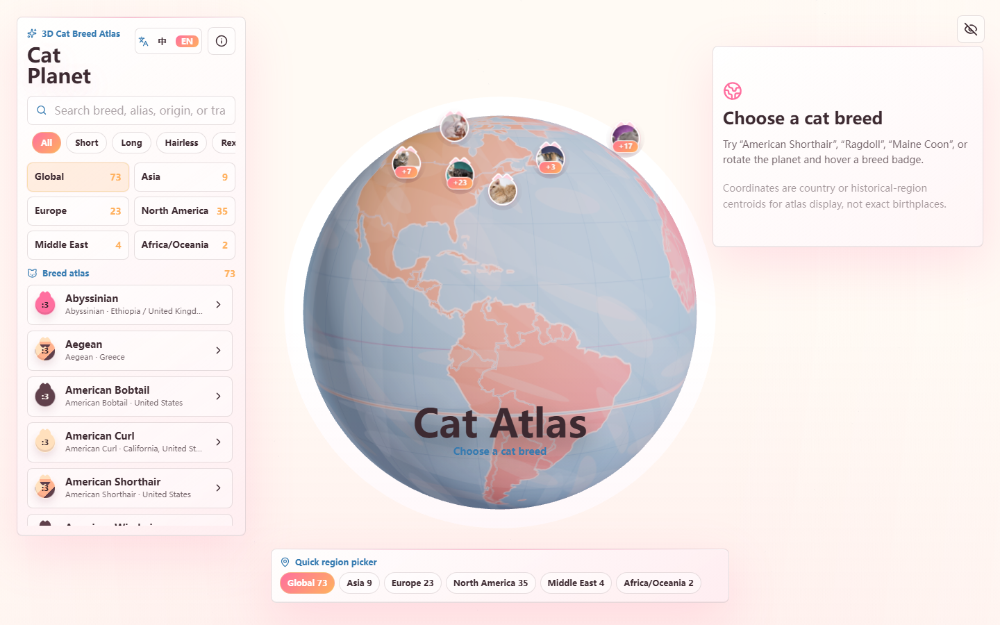
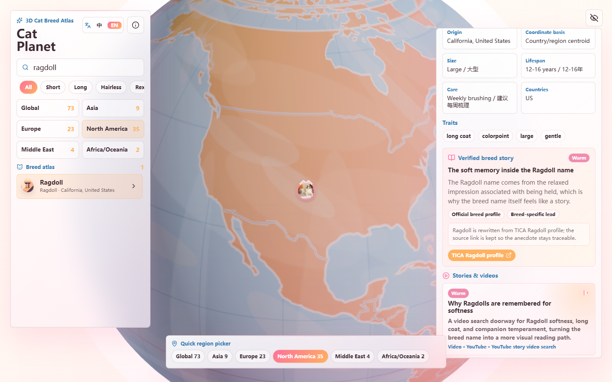
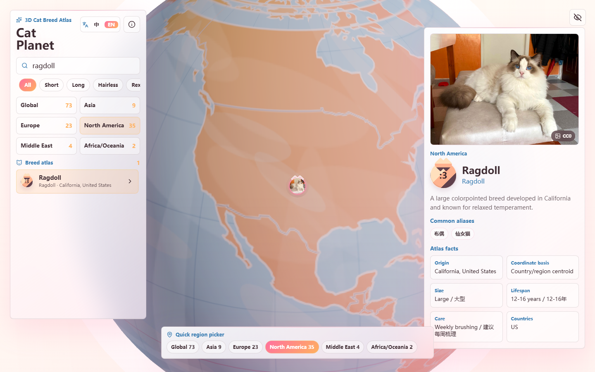

# Cat Planet

**猫咪星球** is an interactive 3D cat breed atlas built with React, TypeScript, Three.js, Drei, and GSAP. It maps cat breed origins onto a real WebGL globe and combines breed search, region filtering, photo markers, mobile browsing, and story links in one visual experience.

Live demo:

https://qq598516797-dotcom.github.io/cat-planet/

## Preview

### 3D Breed Globe



### Breed Stories And Videos



### Breed Detail Reading View



### Mobile Experience


## Features

- Real Three.js 3D globe, not a static image or CSS-only fake 3D.
- Global cat breed origin visualization with photo-based breed markers.
- Smart marker clustering: hover to expand on desktop, tap to expand on mobile.
- Chinese-friendly search terms, including common names such as 美短, 英短, 布偶, 缅因, 无毛, 矮脚, and 豹猫.
- Chinese and English UI modes.
- Region shortcuts for Global, Asia, Europe, North America, Middle East, and Africa/Oceania.
- Breed detail pages with photos, origin notes, common names, atlas facts, stories, and external video/story links.
- GSAP-powered intro animation and interface motion.
- Responsive layouts for desktop and mobile.

## Tech Stack

- Vite
- React
- TypeScript
- Three.js
- @react-three/fiber
- @react-three/drei
- GSAP
- Zustand
- Lucide React

## Local Development

Install dependencies:

```bash
npm install
```

Start the dev server:

```bash
npm run dev
```

Create a production build:

```bash
npm run build
```

Run lint checks:

```bash
npm run lint
```

## Data Notes

Breed names are primarily referenced from TICA breed information. Origin coordinates use country or historical-region centroids for atlas visualization, not precise birth locations. Photos, stories, and external video links include source references inside the app.

## Project Status

This is a public MVP preview. Planned improvements include:

- Adding more verified breed stories, news links, and video references.
- Improving mobile reading and marker interaction.
- Further optimizing marker clustering and animation performance.
- Adding more visual filters for exploring breeds.
