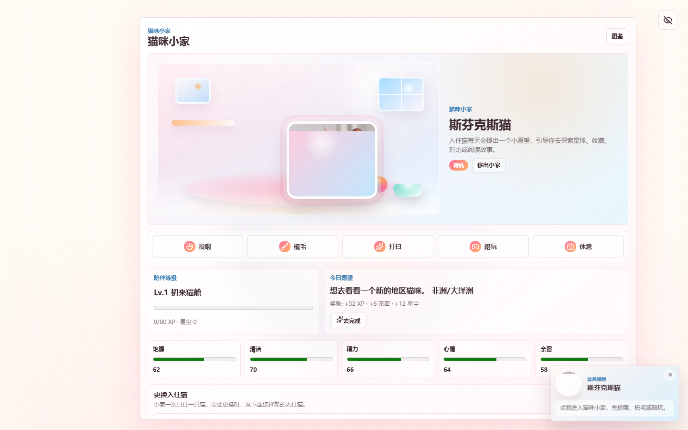
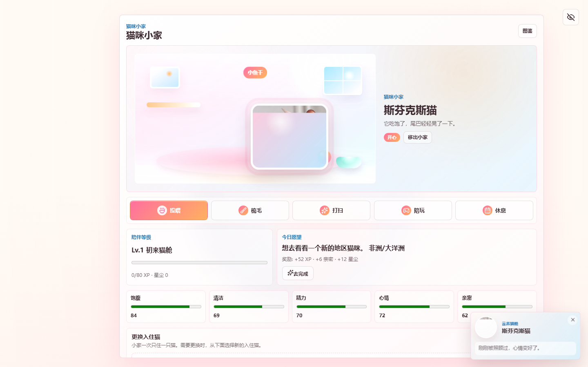
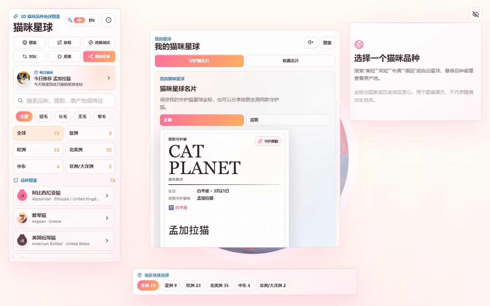
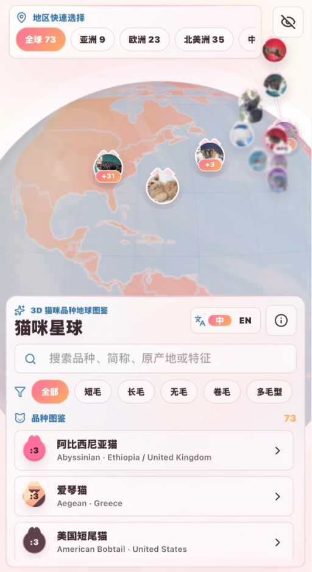

# Cat Planet

**Cat Planet** is a playful 3D cat atlas with a Cat Home feeding loop at the front of the experience. Visitors can care for a home cat, complete daily wishes, explore breed origins on a WebGL globe, compare breeds, and save shareable cat-planet moments.

Live demo:

https://qq598516797-dotcom.github.io/cat-planet/

## Preview

### Cat Home First



### Feeding Interaction



### 3D Breed Globe


### Guardian Cat Card



### Mobile Experience



## Current Focus

- Cat Home is now the first surface users see.
- One active home cat can be fed, groomed, cleaned, played with, rested, changed, or removed.
- Daily wishes connect the mini-game back to the planet: explore a region, find a personality match, read a story, favorite a breed, or compare cats.
- GSAP powers the visible care feedback: food motion, cat movement, room shine, toy motion, reward particles, intro animation, constellation reveal, and smooth UI transitions.
- App-level, WebGL, and localStorage fallbacks reduce the chance of a black-screen failure.

## Features

- Virtual Cat Home with five care stats: fullness, cleanliness, energy, mood, and affection.
- Daily wish and lightweight companion-level loop, without coins, penalties, timers, or heavy game systems.
- Real Three.js globe with photo-based cat markers and breed origin landing.
- Personality star map for exploring cats by temperament.
- Breed comparison tools, including drag-friendly PC interactions and button fallback.
- Guardian cat constellation based on birthday selection.
- Chinese and English UI modes.
- Local-first state persistence with Zustand and localStorage.
- Responsive shell for desktop and mobile, with PC experience prioritized during current iteration.

## Tech Stack

- Vite
- React
- TypeScript
- Three.js
- @react-three/fiber
- @react-three/drei
- GSAP, @gsap/react, Flip, Draggable
- Zustand
- Lucide React

## Local Development

Install dependencies:

```bash
npm install
```

Start the dev server on the same address used during verification:

```bash
npm run dev -- --host 127.0.0.1 --port 5173
```

Create a production build:

```bash
npm run build
```

Preview the production build:

```bash
npm run preview -- --host 127.0.0.1 --port 4173
```

Run checks:

```bash
npx tsc --noEmit
npm run lint -- --max-warnings=0
```

## Data Notes

Breed names are primarily referenced from TICA breed information. Origin coordinates use country or historical-region centroids for atlas visualization, not precise birth locations. Local and coat-pattern cats are labeled separately from formal breeds where needed.

## Project Status

This is an active public MVP. The current direction is a PC-first exploration product: Cat Home drives return visits, the 3D planet provides discovery, and personality/guardian/compare tools help visitors keep clicking without turning the app into a heavy game.
